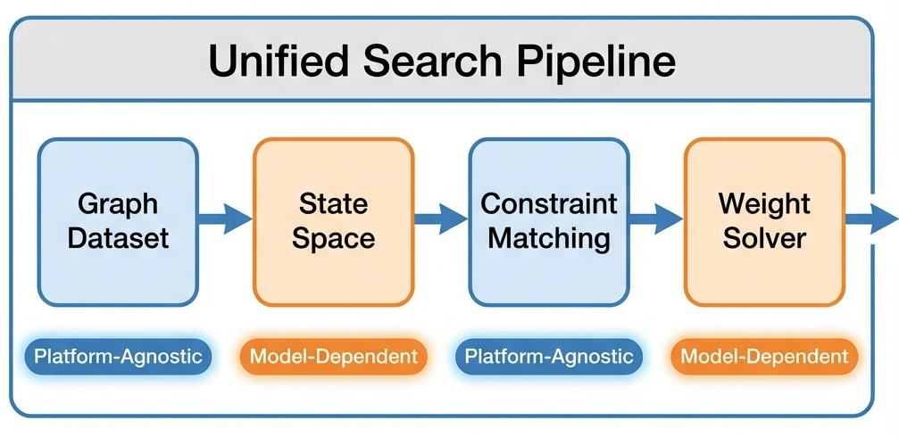

# GadgetSearch

[](https://isPANN.github.io/GadgetSearch.jl/stable/)
[](https://isPANN.github.io/GadgetSearch.jl/dev/)
[](https://github.com/isPANN/GadgetSearch.jl/actions/workflows/CI.yml?query=branch%3Amain)

A Julia package for searching computational gadgets in graph structures. This package finds weighted graphs that implement logic functions through their energy landscapes, supporting both **Rydberg atom** (MIS-based) and **QUBO** (general binary optimization) models.

## Installation

```julia
using Pkg
Pkg.add("GadgetSearch")
```

## Architecture




## Energy Models

GadgetSearch supports two energy models for gadget search:

| Model | State Space | Energy Function | Use Case |
|-------|-------------|-----------------|----------|
| `RydbergModel` | Maximal Independent Sets (MIS) | $E(\boldsymbol{\sigma})=\sum_{i=1}^{n} h_i \sigma_i$ | Rydberg atom arrays |
| `QUBOModel` | All 2ⁿ binary states | $E(\boldsymbol{\sigma})=\sum_{i=1}^{n} h_i \sigma_i + \sum_{i,j} J_{ij} \sigma_i \sigma_j$ | General QUBO problems |

Here, $\boldsymbol{\sigma} = (\sigma_1, \sigma_2, \ldots, \sigma_n)$ is the binary state vector, $h_i$ is the vertex weight, and $J_{ij}$ is the edge weight.

## Quick Start

### Rydberg Model (MIS-based)

```julia
using GadgetSearch, HiGHS

# Generate Unit Disk Graph dataset (Rydberg blockade constraint)
generate_full_grid_udg(Triangular(), 2, 2; path="rydberg_graphs.g6")
loader = GraphLoader("rydberg_graphs.g6")

# Define truth table constraints
constraints = [
    TruthTableConstraint(BitMatrix([0 0 0; 1 0 1; 0 1 1; 1 1 1])),  # OR gate
    TruthTableConstraint(BitMatrix([0 0 0; 1 0 0; 0 1 0; 1 1 1]))   # AND gate
]

# Search using Rydberg model
results, failed = search_gadgets(
    RydbergModel,
    loader, 
    constraints;
    optimizer=HiGHS.Optimizer,
    objective=h -> sum(h),  # Only vertex weights
    max_result_num=5
)
```

### QUBO Model (Full State Space)

```julia
using GadgetSearch, HiGHS

# Generate complete graph dataset (all pairs connected)
generate_full_grid_graph(Triangular(), 2, 3; path="qubo_graphs.g6")
loader = GraphLoader("qubo_graphs.g6")

# Define state constraints (explicit ground states)
constraints = [
    StateConstraint(["001", "011", "101", "111"]),  # OR-like
    StateConstraint(["000", "010", "100", "111"])   # AND-like
]

# Search using QUBO model
results, failed = search_gadgets(
    QUBOModel,
    loader, 
    constraints;
    optimizer=HiGHS.Optimizer,
    objective=(h, J) -> sum(h) + sum(J),  # Vertex + edge weights
    max_result_num=5
)

# Access QUBO-specific weights
if !isempty(results[1])
    gadget = results[1][1]
    println("Vertex weights: ", gadget.vertex_weights)
    println("Edge weights: ", gadget.edge_weights)
end
```

## Core Types

### Energy Models
- `RydbergModel`: MIS state space, vertex weights only
- `QUBOModel`: Full 2ⁿ state space, vertex + edge weights

### Constraint Types
- `TruthTableConstraint(::BitMatrix)`: Define ground states via truth table
- `StateConstraint(::Vector{String})`: Define ground states explicitly (e.g., `["00", "11"]`)

### Gadget
```julia
struct Gadget{M<:EnergyModel, T<:Real}
    constraint::GadgetConstraint
    graph::SimpleGraph{Int}
    pins::Vector{Int}
    vertex_weights::Vector{T}   # hᵢ
    edge_weights::Vector{T}     # Jᵢⱼ (QUBO only)
    edge_list::Vector{Tuple{Int,Int}}
    pos::Union{Nothing, Vector{Tuple{Float64, Float64}}}
end
```

## Core Functions

### Search Functions
```julia
# Unified search interface
search_gadgets(ModelType, loader, constraints; kwargs...)

# Convenience wrappers
search_by_truth_tables(loader, truth_tables; ...)      # Rydberg
search_by_state_constraints(loader, constraints; ...)  # QUBO
```

### Graph Generation
```julia
# Unit Disk Graphs (for Rydberg)
generate_full_grid_udg(Triangular(), nx, ny; path="udg.g6")
generate_full_grid_udg(Square(), nx, ny; path="udg.g6")

# Complete Graphs (for QUBO)
generate_full_grid_graph(Triangular(), nx, ny; path="complete.g6")
generate_full_grid_graph(Square(), nx, ny; path="complete.g6")
```

### Visualization
```julia
# Plot gadget with weights
plot_gadget(gadget, "output.png"; show_weights=true, round_weights=true)

# Verify gadget correctness
check_gadget_rydberg(gadget)  # Using MIS state space
check_gadget_qubo(gadget)     # Using full state space
```

## Examples

See the `examples/` directory for complete working examples:

- `trangular_Rydberg_example.jl`: Logic gates using Rydberg model on UDG
- `triangular_QUBO_example.jl`: State constraints using QUBO model on complete graphs

## Search Parameters

```julia
results, failed = search_gadgets(
    ModelType,
    loader, 
    constraints;
    optimizer=HiGHS.Optimizer,     # Required: optimization solver
    objective=...,                  # Objective function (model-specific)
    allow_defect=true,              # Allow zero-weight vertices
    max_result_num=10,              # Max results per constraint
    max_samples=10000,              # Max weight combinations to try
    pin_candidates=[[1,2,3], ...],  # Specific pin combinations
    check_connectivity=true         # Ensure gadget remains connected
)
```

## Requirements

- Julia 1.10+
- Optimization solver (HiGHS.jl recommended)
- Optional: `shortg` from Nauty/Traces for graph canonicalization

## Memory Management

```julia
# Check MIS cache statistics
get_cache_stats()

# Clear cache to free memory
clear_cache!()

# GraphLoader with caching
loader = GraphLoader("dataset.g6"; 
    enable_cache=true, 
    max_cached=5000
)
```

## Citation

If you use this package in your research, please cite:

```bibtex
@article{pan2025encoding,
  title={Encoding computationally hard problems in triangular Rydberg atom arrays},
  author={Pan, Xi-Wei and Zhou, Huan-Hai and Lu, Yi-Ming and Liu, Jin-Guo},
  journal={arXiv preprint arXiv:2510.25249},
  year={2025}
}
```

## License

MIT License
